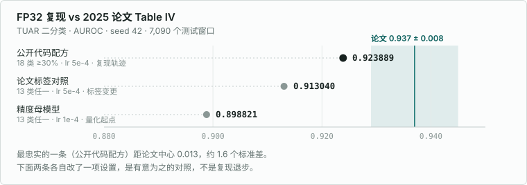
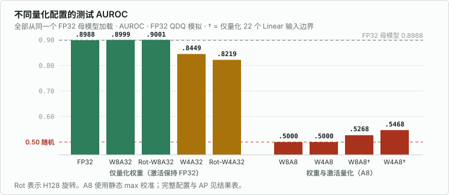

# 实验结果

本页汇总 FEMBA-Tiny / TUAR 的单种子 seed-42 对照。指标使用官方 task 的
TorchMetrics 路径，AP 为 average precision，Balanced Accuracy 为宏平均召回率。
AUROC／AP 沿用原任务的正类原始 logit 逐批评分；分类结果由两类 softmax 的 argmax 得到。

## FP32 结果与论文对照

| FP32 结果 | 标签／AdamW 学习率 | AUROC | AP | 用途 |
| --- | --- | ---: | ---: | --- |
| 公开代码配方 | 18 类、占比 ≥30%／5e-4 | 0.923889 | 0.933093 | 记录代码复现轨迹 |
| 论文标签对照 | 13 类、任一出现／5e-4 | 0.913040 | 0.944898 | 检验训练／验证标签变更 |
| 精度母模型 | 13 类、任一出现／1e-4 | 0.898821 | 0.938437 | 后续精度实验的共同起点 |

论文标签组遵循论文的标签语义，归一化、AdamW 和模型实现沿用公开代码。

图中的色带对应[论文 Table IV](https://arxiv.org/html/2502.06438v2) 报告的
0.937 ± 0.008。公开代码配方得到 0.923889，比论文中心值低 **1.31 个百分点**，
是本次复现最接近论文的结果。三个点各对应一次 seed-42 运行，展示不同设置下的结果。

图中第二个点同时更换了训练、验证和测试标签，评价目标随之改变。
同一个旧模型仅改用新测试标签评分，AUROC 就从 0.923889 变为 0.907507；
在相同新标签下重新训练，结果为 0.913040，比重评分对照高 0.5533 个百分点。
因此，标签变更的影响要看下文的同标签对照，不能直接用图中相邻两点相减判断。

第三个点是低学习率对照，也作为后续量化的共同起点。它的验证 loss 最低，
测试 AUROC 却低于另外两组。量化图中的虚线固定在 **0.898821**，
各精度版本相对这条线比较，避免把训练设置的差异算进量化损失。

## 当前精度对照

所有版本从 1e-4 组的同一 FP32 母模型加载，验证集 5,899 个窗口、测试集 7,090 个窗口，
顺序及标签一致。W/A 表示权重／激活位宽，量化通过 FP32 QDQ 模拟。
A8 对比原 57 处量化位置与 22 个 Linear 输入边界。

图中虚线为 FP32 母模型，红线为 AUROC 0.5；带 † 的两项使用 22 个 Linear 输入边界，
其余 A8 使用 57 处、浮点尺度。纵轴从 0.45 起，比较时看柱顶数值的差。
Rot-A8、二次幂尺度和 FP16 的结果列在下表。

| 版本 | AUROC | AP | Accuracy | Balanced Accuracy | 状态 |
| --- | ---: | ---: | ---: | ---: | --- |
| FP32 | 0.898821 | 0.938437 | 83.5543% | 84.4706% | 正常 |
| W8A32 | 0.899945 | 0.938976 | 83.6530% | 84.3905% | 在精度容差内 |
| W4A32 | 0.844892 | 0.903830 | 57.6728% | 49.9568% | 精度退化 |
| W8A8，57 处／浮点尺度 | 0.500000 | 0.577433 | 57.7433% | 50.0000% | 全预测正类 |
| W4A8，57 处／浮点尺度 | 0.500000 | 0.577433 | 57.7433% | 50.0000% | 全预测正类 |
| W8A8，57 处／二次幂尺度 | 0.500000 | 0.577433 | 57.7433% | 50.0000% | 全预测正类 |
| FP16-direct | — | — | — | — | 首批验证 NaN |
| FP16-state-safe | — | — | — | — | 首批验证 NaN |
| AMP-FP16 | — | — | — | — | 首批验证 NaN |
| Rot-W8A32 | 0.900130 | 0.939189 | 83.6107% | 84.4433% | 在精度容差内 |
| Rot-W4A32 | 0.821896 | 0.890039 | 57.6164% | 49.9035% | 精度退化 |
| Rot-W8A8，57 处／浮点尺度 | 0.500000 | 0.577433 | 57.7433% | 50.0000% | 全预测正类 |
| Rot-W4A8，57 处／浮点尺度 | 0.500000 | 0.577433 | 57.7433% | 50.0000% | 全预测正类 |
| W8A8，22 个 Linear 输入 | 0.526839 | 0.604017 | 57.7433% | 50.0000% | 全预测正类 |
| W4A8，22 个 Linear 输入 | 0.546794 | 0.619750 | 57.7433% | 50.0000% | 全预测正类 |

### 仅量化权重：W8 接近基线，W4 的分类结果明显退化

W8A32 相对 FP32 的 AUROC 增加 0.1124 个百分点，AP 增加 0.0539 个百分点，
Balanced Accuracy 下降 0.0801 个百分点，满足各项指标下降不超过 0.5 个百分点的预设容差。
混淆矩阵显示，W8A32 比 FP32 多识别出 44 个正类，同时多将 37 个负类误判为正类。
量化舍入会改变样本得分及其排序；本次 AUROC 略升、Balanced Accuracy 略降，整体仍接近 FP32。
当前结果支持 W8 权重 PTQ 保留了接近 FP32 的分类质量，尚无重复实验支持“量化提升准确率”的结论。

W4A32 的 AUROC 下降 5.3929 个百分点，仍有 0.844892，但 Balanced Accuracy 已降到
49.9568%。7,090 个窗口中，7,077 个被预测为正类，占 99.82%。
AUROC 衡量正类得分的排序，分类指标则依赖最终类别判定；有一定排序能力的模型，
仍可能把几乎所有样本判到同一类。W4 的退化同时表现为得分排序变差，
以及当前分类规则下的负类识别几乎丢失。

### 激活量化：收窄边界后仍未恢复分类

57 处的 W8A8、W4A8 及 W8A8 二次幂尺度组均得到 AUROC 0.5，并把全部样本预测为正类。
此时 Accuracy 57.7433% 恰好等于测试集正类占比；正类召回率为 100%、负类为 0%，
所以 Balanced Accuracy 为 50%。高于 50% 的 Accuracy 来自类别比例。

改为 22 个 Linear 输入边界后，W8A8／W4A8 的 AUROC 分别升到 0.526839／0.546794，
AP 也有所回升，但分类仍全部为正类。这组对照说明量化位置影响得分排序；
移除对 scan 的 x、B、C、delta 的直接量化，仍不足以恢复当前 PTQ 配置的分类结果。
这里两组 A8 共用校准样本和尺度规则，改变的是量化边界。

### 静态 max 校准为何会丢失大量激活

Linear22 W8A8 首个前向分支的输出投影输入，满批为 `256 × 80 × 1540 = 31,539,200` 个元素。
8 批校准共 252,313,600 个元素，绝对最大值 56,777,900，静态量化步长为 447,070.07874。
验证和测试共 1,600,244,800 个元素，其中 1,600,187,460 个从非零量化为零，约占 99.9964%；
余下 57,340 个包含原始零和存活的非零元素。仅 5 个元素发生裁剪，clip rate 约为 3.12e-9。
该点的主要可见损失是归零：逐张量最大值决定尺度，大幅值扩大了整个张量的量化间距。

具体来说，该点使用 `s = max_abs / 127`，量化后还原为
`clamp(round(x / s), -127, 127) × s`。步长约为 44.7 万，绝对值小于约 22.4 万的非零元素就会被舍入为零。
因此，裁剪率极低也可能伴随严重的信息损失：较小的信号被压到同一个零值，
而非在量程上界被截断。上述 99.9964% 是 **Linear22/W8A8 首个前向输出投影输入**的观测，
给出了该处量化退化的直接证据。

### FP16：首批验证出现数值失败

三个 FP16 版本均在首批 256 个验证样本中失败，首个监测到的非有限输出位于
`mamba_blocks.0`：形状 `[256,80,385]`，含 6,545 个 NaN。
direct 转换整个模型；state-safe 保留 `A_log`、`D` 和 `dt_proj.bias` 为 FP32；
AMP 使用 FP16 autocast。三种路径都未产生可评分的完整预测，因此表中留空。
当前监测定位到首个 Mamba 块，尚未细分到块内最先产生 NaN 的算子。

### H128 旋转：峰值下降，分类效果取决于量化配置

旋转在五个 Mamba 输出投影的激活和权重两侧配对执行。未量化时在线性代数上等价，
量化时则改变各分量的幅值分布和舍入误差。它要回答的是：把大值分散后，
同样的量化位宽能否保留更多有用信号。

旋转通过结构正对照、6 个负对照及训练／验证探针检查，采用
[2026-09-22 RMS 协议](PROTOCOL.md#2026-09-22旋转数值检查修订)。
Rot-W8A32 比未旋转 W8A32 的 AUROC 高 0.0185 个百分点，仍接近 FP32；
Rot-W4A32 相对未旋转组低 2.2996 个百分点，两组 Rot-A8 仍全部预测正类。
这四组结果中，旋转未带来一致的分类收益。原逐元素检查失败的证据见[布局检查](rotation_layout_results.json)
和[数值诊断](rotation_numeric_results.json)。

在同一 2,048 个校准样本上，两侧均关闭 W/A 量化，57 处方案中输出投影前
`scan_gate_output` 的绝对峰值如下；比值为未旋转／旋转。

| 输出投影输入 | 未旋转峰值 | H128 旋转峰值 | 比值 |
| --- | ---: | ---: | ---: |
| 第 0 块，前向 | 56,777,900 | 5,267,555.5 | 10.7788 |
| 第 0 块，反向 | 25,163,848 | 2,338,181.5 | 10.7621 |
| 第 1 块，前向 | 57,324.5703 | 6,988.6968 | 8.2025 |
| 第 1 块，反向 | 320,374.6875 | 28,820.3340 | 11.1163 |
| 分类头 | 82.8360 | 19.1689 | 4.3214 |

H128 把这些边界的峰值缩小 4.3–11.1 倍，确认幅值重分布确实发生。
峰值只描述最大的单个元素，量化误差还取决于其余元素的分布、权重舍入和后续计算；
Rot-A8 也仍有其他量化位置。因此，峰值降低与最终分类改善需要分别观察。
本次测到了峰值下降，当前 57 处 PTQ 的 A8 分类仍未恢复，W4A32 的 AUROC 反而下降。

末端分类层给出了 Rot-A8 失去样本区分能力的直接证据。两组 `classifier_pool_out`
在校准时固定的步长均为 0.110308，半步长约 0.055154。开启量化后，
Rot-W8A8／Rot-W4A8 在完整验证与测试集上的输入绝对最大值分别只有 0.007858／0.015716，
都低于半步长，因此该位置全部舍入为零。最后的 `fc3` 接收零向量，输出只剩偏置，
样本之间的得分差异消失。数值见[旋转结果 JSON](rotation_results.json) 中各变体的
`inference_artifact.calibration_sites.classifier_pool_out` 与
`inference_artifact.activation_statistics.sites.classifier_pool_out`。

因此，后续 QAT 对照除了观察旋转能否压低峰值，还应观察实际量化推理中末端输入与
固定尺度是否匹配，以及样本间得分差异是否恢复。未旋转与固定 H128 的两套 PTQ 结果
可作为这组训练对照的起点。

五行均通过保存重载，10 套验证／测试指标独立重放的最大绝对误差约为 1.19e-7，
详见[旋转结果](rotation_results.json)。

## FP32 基线对照

### 执行修正前后记录

这组对照保留原公开代码的 18 类、伪迹占比 ≥30% 标签，使用相同数据划分。
完整累积批次和关闭 TF32 一同修正，主结果统一采用验证损失最优检查点。
表中是两次 seed-42 运行的观测值；各项修正的独立作用与跨种子波动尚未测量。

| 模型 | 测试 AUROC | 测试 AP |
| --- | ---: | ---: |
| 修正前 best | 0.899151 | 0.916354 |
| 修正后 best | 0.923889 | 0.933093 |

修正前数值见[原运行结果](upstream2025_results.json)，修正后见[控制实验](fp32_control_results.json)。

### 论文标签对照

改用论文的 13 类伪迹及“窗口内出现即为正类”规则。下表两模型均在相同的
新测试标签上评分，只改变训练／验证标签协议，其他训练设置不变。

| 模型 | 测试 AUROC | 测试 AP |
| --- | ---: | ---: |
| 上一组修正后 best，按新标签重评分 | 0.907507 | 0.942418 |
| 使用论文标签训练的 best | 0.913040 | 0.944898 |

新规则使测试集 618 个窗口由负类变为正类，正类占比从 49.0268% 升到 57.7433%。
同一个旧模型重评分后，AUROC 降低、AP 升高，说明标签口径会同时改变评价目标和类别比例。
在新测试标签固定后，新标签训练组的 AUROC 提高 0.5533 个百分点、AP 提高 0.2480 个百分点。
这比较的是训练及验证标签协议的整体变化，包括各自按验证 loss 选择检查点。

### 学习率对照与母模型选择

在论文标签上，仅将 AdamW 学习率从 5e-4 改为 1e-4，两组均完成 30 轮／1,620 步。

| 学习率 | best 轮次／步数 | 最低验证 loss | 测试 AUROC | 测试 AP |
| --- | --- | ---: | ---: | ---: |
| 5e-4 | 第 5 轮／270 | 0.426979 | 0.913040 | 0.944898 |
| **1e-4** | **第 7 轮／378** | **0.393690** | **0.898821** | **0.938437** |

按预先确定的最低验证 loss 规则，选择 1e-4 检查点作为精度实验母模型。
1e-4 组的验证 loss 更低，测试 AUROC 比 5e-4 组低 1.422 个百分点、
AP 低 0.646 个百分点。末轮验证 loss 分别为 4.305459、1.468594，均高于各自
早期最优值。

交叉熵考察每个样本的预测概率，AUROC 考察正负样本的得分排序，两者可以选出不同模型。
本次按照验证 loss 冻结 1e-4 检查点，保留测试 AUROC 的实际结果。
两组最优检查点分别出现在第 5、7 轮，后续训练的验证 loss 上升；
因此精度对照使用各轮中选出的 best，而不使用第 30 轮模型。

相对 2025 论文 Table IV 的 AUROC 0.937，三组结果分别低 1.31、2.40、3.82 个百分点。
固定上下界归一化、AdamW 和实际记录级划分是保留的代码设置；这些差异的独立影响
尚未测量。多种子重复实验尚未运行。

## W8A8 0.77 的论文来源

[2025 FEMBA 原文](https://arxiv.org/html/2502.06438v2) 报告模型与下游任务结果，未报告 W8A8 量化实验。
AUROC **0.77** 来自 2026 年 [FEMBA on the Edge，IV-C／Table VI](https://arxiv.org/html/2603.26716v1#S4.SS3)：
TUAB 上的 W8A8 PTQ，AUPR 0.71、Accuracy 55.91%，对应 FP32 AUROC 0.89。
该研究采用新的预训练和线性分类头；本页精度对照使用 2025 模型在 TUAR 上训练的母模型。

## 结果文件

| 文件 | 内容 |
| --- | --- |
| [fp32_control_results.json](fp32_control_results.json) | 执行修正后的基线、曲线和重载核验 |
| [paper_label_results.json](paper_label_results.json) | 标签映射、同标签评分和数据身份核验 |
| [lr_control_results.json](lr_control_results.json) | 学习率单因素对照及冻结母模型 |
| [precision_results.json](precision_results.json) | 完整指标、校准、一致性和保存重载结果 |
| [linear_scope_results.json](linear_scope_results.json) | 同母模型的 22 个 Linear 输入边界对照 |
| [rotation_results.json](rotation_results.json) | RMS 协议下四个旋转版本的完整评估 |
| [rotation_layout_results.json](rotation_layout_results.json) | identity 布局修复及 H128 配对检查 |
| [rotation_numeric_results.json](rotation_numeric_results.json) | 固定 h/W 的 FP32／FP64 旋转数值诊断 |

结果 JSON 保留实际执行源码、检查点、数据与校准集合的哈希；完整原始日志和
逐样本证据留在本地。实验设置和命令见 [PROTOCOL.md](PROTOCOL.md)。

[源码版本对应](source_versions.json) 记录实验执行与本次发布的文件指纹，以及路径移植和 identity 修复。
